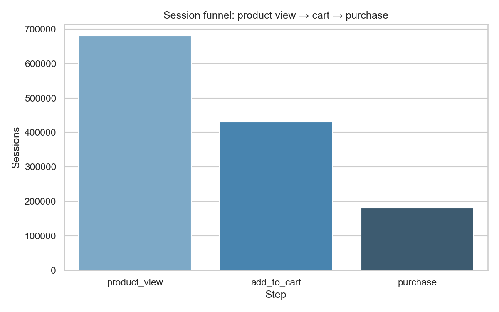
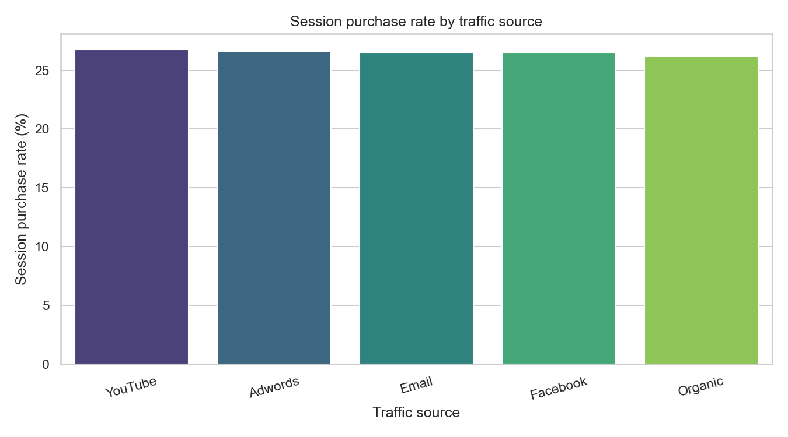
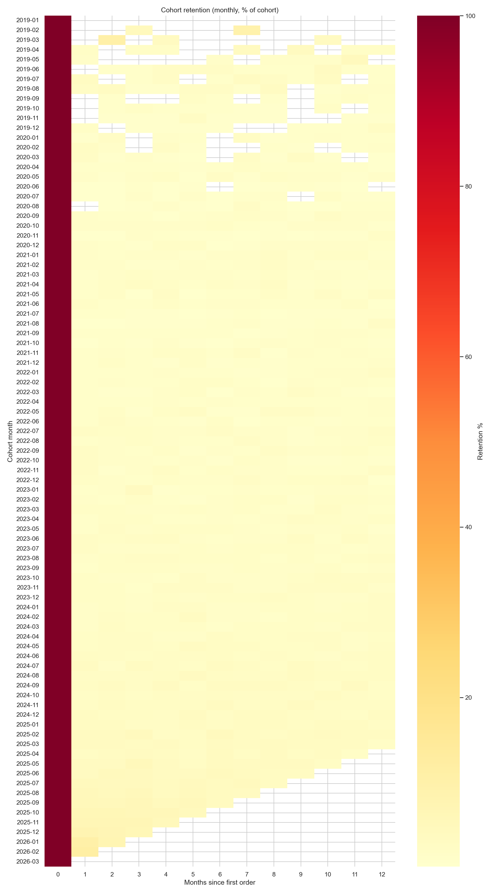
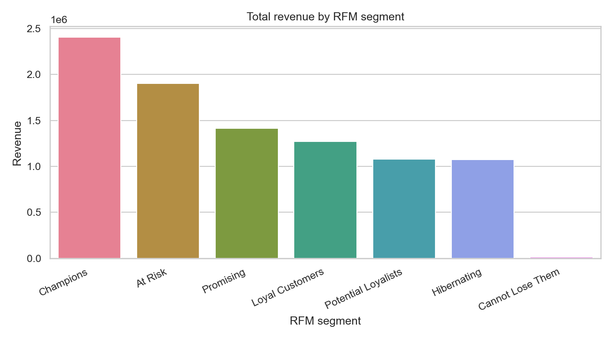
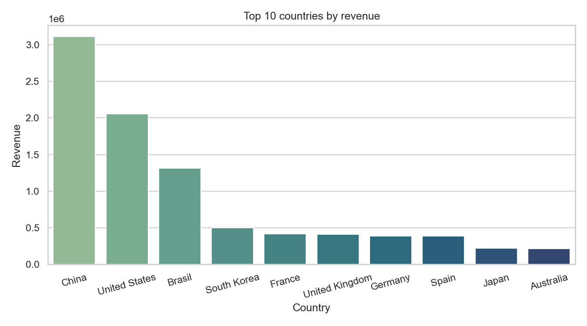

# E-commerce Funnel, Cohort, and RFM Analysis

Portfolio-ready analytics project using **`bigquery-public-data.thelook_ecommerce`** for session-level funnel analysis, cohort retention, RFM segmentation, and channel / browser / geo performance. Includes **BigQuery SQL**, optional **Looker Studio** notes, and a **Python visualization** layer that saves PNGs for README and portfolios.

## Business problem

E-commerce teams need to see where users drop out of the journey, how often customers return, which segments drive value, and which acquisition sources and geographies matter—without relying on unsupported ad metrics (no CTR/CPC/CPA/ROAS claims here).

## Quick start (Python charts)

1. **Prerequisites:** Python 3.10+, [Google Cloud SDK](https://cloud.google.com/sdk) with `bq` authenticated (`bq` should run queries successfully).

2. **Install and run**

```bash
cd ecommerce-funnel-cohort-rfm-analysis
python3 -m venv .venv
source .venv/bin/activate          # Windows: .venv\Scripts\activate
pip install -r requirements.txt
python python/generate_charts.py
```

3. **Outputs:** PNGs and a metrics summary are written to `outputs/figures/`.

**Authentication**

- **Default (recommended):** the script runs SQL via the **`bq` CLI** using your existing gcloud/bq login. Set `GCP_PROJECT` if needed (defaults to `modular-embassy-469320-h8` for billing project only).
- **Alternative:** set `USE_BQ_CLI=0` to use the `google-cloud-bigquery` Python client with [Application Default Credentials](https://cloud.google.com/docs/authentication/application-default-credentials).

**Do not commit** service account JSON or secrets (see `.gitignore`).

## Visualizations (generated)

| File | Description |
|------|-------------|
| `outputs/figures/01_funnel_product_cart_purchase.png` | Sessions at product view → add to cart → purchase |
| `outputs/figures/02_session_purchase_rate_by_source.png` | Session purchase rate by `traffic_source` |
| `outputs/figures/03_cohort_retention_heatmap.png` | Cohort × months since first order (retention %) |
| `outputs/figures/04_rfm_customers_by_segment.png` | Customers by RFM segment |
| `outputs/figures/04_rfm_revenue_by_segment.png` | Revenue by RFM segment |
| `outputs/figures/04_rfm_frequency_vs_monetary.png` | Sample scatter: frequency vs monetary by segment |
| `outputs/figures/05_top_countries_revenue.png` | Top countries by revenue |

### Preview

<p align="center">
  
  
</p>

<p align="center">
  
</p>

<p align="center">
  
  
</p>

## Insights (summary)

See **[docs/insights.md](docs/insights.md)** for narrative. Numeric highlights also appear in `outputs/figures/summary_metrics.json` after you run the generator.

1. **Funnel:** **680,868** sessions with product view; **430,501** reach cart; **180,868** purchase—optimize browse-to-cart and cart-to-purchase.
2. **Channels:** Session purchase rates cluster in the **~26–27%** range by source; site experience and retention matter alongside channel mix.
3. **RFM:** **Champions** drive a large share of revenue; **At Risk** is both large and valuable for win-back.
4. **Geo:** Revenue concentrates in **China**, **United States**, **Brasil** (see chart / JSON).
5. **Cohort heatmap:** Low repeat engagement in later periods vs cohort size—prioritize lifecycle and second purchase.

## Dataset overview

- **Source:** `bigquery-public-data.thelook_ecommerce`
- **Tables used in SQL / Python:** `events`, `orders`, `order_items`, `users`, `products`
- **Approximate date coverage (validated earlier):** events through **2026-03-26**, orders through **2026-03-22**

## Repo structure

```text
ecommerce-funnel-cohort-rfm-analysis/
├── README.md
├── requirements.txt
├── .gitignore
├── python/
│   └── generate_charts.py
├── outputs/
│   └── figures/              # PNGs + summary_metrics.json (regenerated locally)
├── sql/
│   ├── 01_dataset_validation.sql
│   ├── 02_funnel_analysis.sql
│   ├── 03_retention_cohort.sql
│   ├── 04_rfm_analysis.sql
│   └── 05_channel_device_geo_performance.sql
├── docs/
│   ├── business_questions.md
│   ├── data_dictionary.md
│   └── insights.md
└── dashboard/
    ├── looker_studio_dashboard_plan.md
    └── looker_studio_build_guide.md
```

## SQL modules

| File | Purpose |
|------|---------|
| `sql/01_dataset_validation.sql` | Row counts, date ranges, sanity checks |
| `sql/02_funnel_analysis.sql` | Session funnel and conversion by source/browser |
| `sql/03_retention_cohort.sql` | Monthly cohort retention |
| `sql/04_rfm_analysis.sql` | RFM scores and segments |
| `sql/05_channel_device_geo_performance.sql` | Channel, browser, geo performance |

## Optional: BigQuery views & Looker Studio

You can materialize these queries as views in your GCP project (e.g. `modular-embassy-469320-h8.ecommerce_funnel_cohort_rfm_analysis`) and connect Looker Studio—see `dashboard/looker_studio_build_guide.md`. **Primary storytelling for this repo is Python + SQL**; Looker is optional.

## KPI definitions

- **Sessions:** distinct `session_id` in `events`
- **Session purchase rate:** sessions with a `purchase` event ÷ all sessions (by segment as coded)
- **Revenue:** sum of `order_items.sale_price` for non-cancelled orders
- **RFM:** recency / frequency / monetary with NTILE-based scores (see `sql/04_rfm_analysis.sql`)

## Push to GitHub

From the project folder:

```bash
git init
git add .
git commit -m "Add TheLook ecommerce analysis: SQL, Python charts, docs"
```

Create an empty repository on GitHub, then:

```bash
git branch -M main
git remote add origin https://github.com/YOUR_USER/YOUR_REPO.git
git push -u origin main
```

Replace `YOUR_USER/YOUR_REPO` with your details.

## Notes and limitations

- No CTR, CPC, CPA, or ROAS—those require ad platform data not present here.
- `browser` is used as a device proxy; there is no GA4-style device category in this schema.
- Re-run `python python/generate_charts.py` after schema or logic changes to refresh figures and `summary_metrics.json`.
